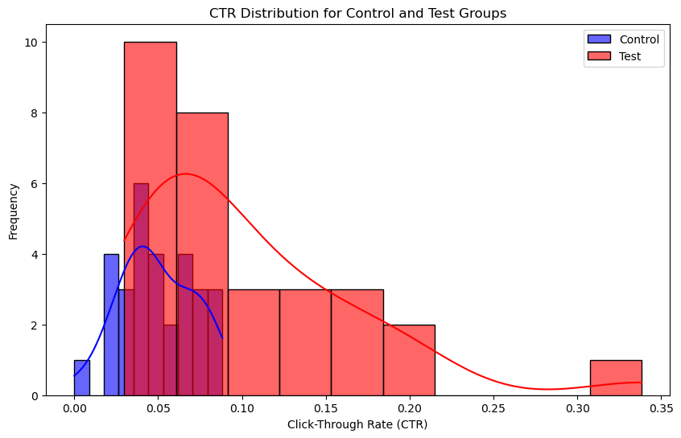
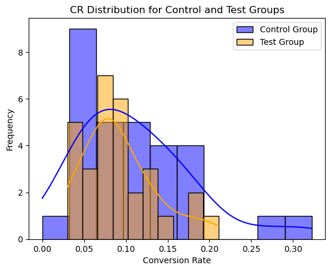

# Marketing Campaigns A/B Testing

Analyzing marketing campaigns using A/B testing in Python to determine the most effective strategy for improving customer acquisition.

---

## Case Study

A company is running two marketing campaigns (Control and Test) to improve customer acquisition for their new product. The goal is to identify which campaign performs better in driving customer engagement and sales.

The campaigns were implemented across multiple platforms, and their performance is evaluated using metrics such as:

- `Click-Through Rate (CTR):` Measures the percentage of clicks on an advertisement compared to impressions.
- `Conversion Rate (CR):` Measures the percentage of purchases relative to website clicks.

---

## Dataset Description

The dataset used for this analysis consists of observations from the two campaigns:

- **Campaign Name:** Name of the marketing campaign.
- **Date:** Campaign run date.
- **Spend [USD]:** Advertising budget spent.
- **# of Impressions:** Total number of ad impressions.
- **Reach:** Number of unique users reached.
- **# of Website Clicks:** Total clicks on the ad.
- **# of Searches:** Number of searches performed on the website.
- **# of View Content:** Number of people who viewed the website content.
- **# of Add to Cart:** Number of items added to cart.
- **# of Purchase:** Total purchases made.
- **Group:** Indicates whether the observation belongs to the control or test group.

---

## Libraries

- **Pandas:** For data manipulation and analysis.
- **Matplotlib & Seaborn:** For creating visualizations.
- **Scipy:** For statistical hypothesis testing.

---

## Methodology

1. **Data Cleaning:**
   - Removed rows with invalid or missing data.
   - Filled missing values with appropriate replacements (e.g., `0`).

2. **Metrics Calculation:**
   - **CTR (Click-Through Rate):**  
     `CTR = # of Website Clicks / # of Impressions`
   - **CR (Conversion Rate):**  
     `CR = # of Purchase / # of Website Clicks`

3. **Statistical Analysis:**
   - Conducted **two-sample t-tests** to compare CTR and CR for control and test groups.
   - Hypotheses:
     - `Null Hypothesis (H₀):` No significant difference between control and test groups.
     - `Alternate Hypothesis (H₁):` Significant difference between control and test groups.

4. **Visualization:**
   - Created histograms and KDE plots to analyze CTR and CR distributions for both groups.

---

## Key Findings

- **CTR Analysis:**
  - The T-test for CTR showed a `statistically significant difference` between the control and test groups.
- **CR Analysis:**
  - The T-test for CR showed `no statistically significant difference` between the control and test groups.
- **Recommendation:**
  - While the test campaign succeeded in driving more engagement (CTR), this did not lead to a proportional increase in sales (CR).

---

## Visualizations

### CTR Distribution

### CR Distribution

---

## Conclusion

- Although the test campaign successfully increased engagement by driving more clicks (as reflected in the higher CTR), this boost in engagement did not translate into a proportional increase in sales (CR). 
- The conversion rate (CR) remained relatively unchanged, indicating that while more users clicked on the ads, it did not result in a corresponding rise in purchases. 
- This suggests that the campaign may have attracted a larger audience but wasn't as effective in converting those users into actual customers.

---